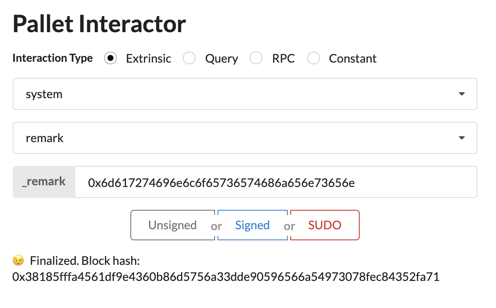

# Challenge 1: Launch a local Substrate development chain

## Description

In this beginner challenge you will learn how to launch a local substrate chain and perform certain actions on it.

Use the Substrate Node Template to launch a local development chain and use the Front-End Template to make a balance transfer and make an on-chain remark with your GitHub username.

## Submission Requirements

Provide a screenshot that shows the finalized transaction.

## Submission

My GitHub username in hex: `6d617274696e6c6f65736574686a656e73656e`

