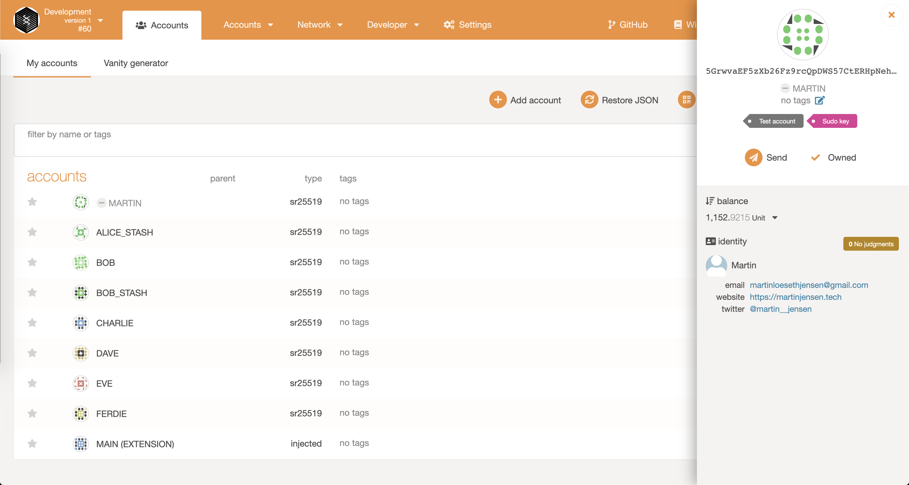
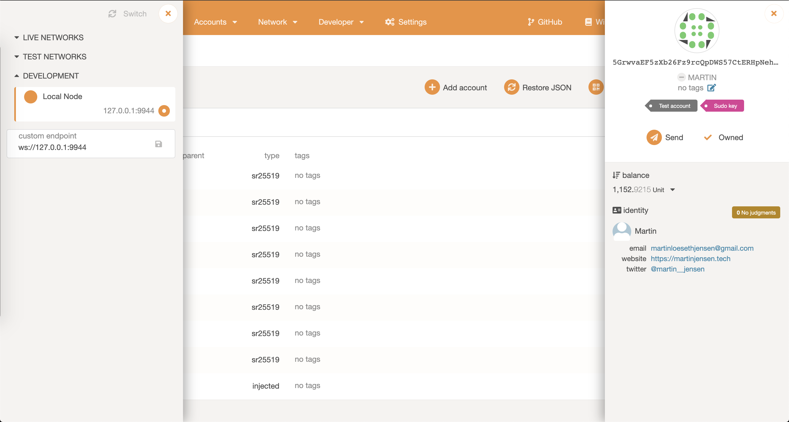

# Challenge 4: FRAME Identity

## Description

Substrate-based chains which implement the Identities pallet let users of the chain set some on-chain metadata through which to identify their accounts. Kusama and Polkadot come with identities built in, but on node-template you have to manually extend the chain. Do it. Add the identity pallet to the node template, then register an identity of an account on your local development chain.

## Submission Requirements

Register an account’s identity on your local node-template chain. Add as many fields as you want, but at least one. See resources for a full guide on how to do this on a chain which supports setting identities. Once you’ve done this, send us a screenshot of that identity visible in Polkadot JS Apps connected to your local chain. Important: Make sure the fields clearly show a value through which we can contact you. E.g. the twitter field should have a valid twitter username, or the email field should have a valid email. We’ll use this to get in touch with you, so if you don’t have this info in your account’s identity, we can’t verify the completion of the task!

## Submission

[Substrate node repo with the Identity pallet](https://github.com/martinloesethjensen/substrate-node-identity)
